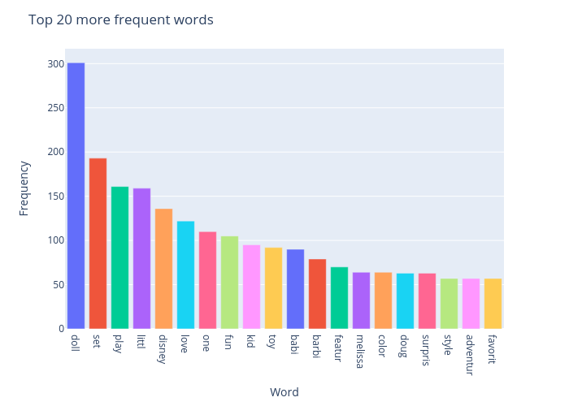
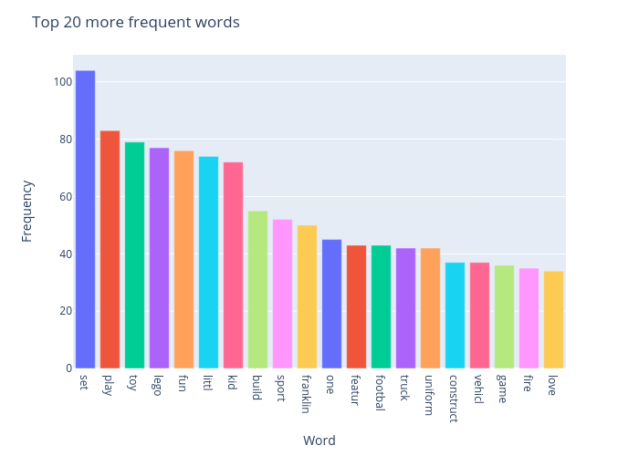

<H1 align="center">  🧸 Project: Toys 🧸 </H1>

---

# Motivation 👨‍👧
I have a small (super cute) daughter. With children's day arriving here in Brazil she was bombarded with all kinds of toys commercials in all possible media. Being in the "asking about everything" phase, she made a long list of questions regarding the toys she saw in these commercials and I was just fascinated by the amount and depth of them! Here are some of them:

>1. 🤷‍♀️ Why do all girls toys look the same? 
>2. 🤷‍♀️ Why are boys always running and jumping in the commercials and girls are always sitting?
>3. 🤷‍♀️ They sure like to say girls are pretty. (Ok, not a question but relevant to the point)
>4. 🤷‍♀️ What if a girl wants a toy that is not a doll, can she get some boys toys?

So, being a bit of a data nerd, I decided to scrape some data and try to address (not answer!) some of her questions with a small project (imagine her excitement getting some super fun presentation from daddy...).

# Choosing the data 📊

After telling her my idea, she now had big expectations. I was on a deadline (children's day was going away and so was her attention spam)! I had to find some good amount of data to scrape and do it quickly. Being a bit of a noob at the whole scraping game, I decided to find something easily scrapable (is that a word!?) with my basic knowledge of BeautifulSoup and some python.

* I first tried Amazon: lots of products, lots of tutorials on how to scrape it. I did write some cool scraper to get a lot of products info but, after some initial products, I was blocked (ops!). I found a lot of tips online on how to avoid being blocked by using proxies, headers and delay(sleep) but it eventually became to long of a process (and my daughter was micromanaging a lot!). So, I moved on to something else (but I did build a cool Amazon scraper for small amount of products!).
* I found out about Hamleys, "the finest toy shop in the world". My daughter liked the website and it is very neatly built (at least for scraping). I scraped toys after doing a "girls" search and a "boys" search to compare the results. The scraper worked greatly, but I felt I needed more data.
* After snooping around google results for "online toy shops", I came across [Kohl's](https://www.kohls.com/catalog/girls-toys.jsp?CN=Gender:Girls+Department:Toys&PPP=48&WS=48&S=1&sks=true&kls_sbp=41944269349877692951351293429971195727) site. It had a lot of toys and a clear "Toys for Girls" section different from a "Toys for Boys" section. This was it! I needed all that sweet data to find out more about my daughter's questions. So, with a bit of BeautifulSoup (and just a smidge of Selenium) I got all the data we needed. Time to explore!

<mark>If you're interested in the details of the scrapers, please take a look at the [script](getPages.py) built and commented [notebook](scraper.ipynb).</mark>

# Peak at some visuals

<figure>

<figcaption align = "center"><b>Fig.1 - Most common words in exclusive boys toys</b></figcaption>
</figure>

<figure>

<figcaption align = "center"><b>Fig.2 - Most common words in exclusive boys toys</b></figcaption>
</figure>

# Conclusions 🎈

First of all, this was super **FUN**! I loved doing something (data related) for and with my daughter. This is the magic of data, it can be used for so many things, including clear and pure curiosity!

Her questions were very well made (and justified, on some level). It was a good exercise to try to address them with data and a bit of creativity. I am sure there are better ways to tackle her concerns with data, and I intend to get back to it once my skills have improved. One major conclusion she was proud of (with repeated *I told you so*'s) is that there seems to be a lot of *effort* to make dolls for girls. Remember: *In a total of 659 exclusive girls toys, the word doll appears 301 times!*

**Disclaimer**: there is some form of criticism in this project. This criticism is **in no way** aimed at **Kohl's** or any of their affiliates as they are not responsible for the making of the toys and the analysed descriptions. If anything, their toys section has A LOT of inclusive toys and my daughter was very happy to see that 💖.

# Finding files:

* [scraper](scraper.ipynb): commented notebook on the scraping process.
* [Data integrity](DataIntegrity.ipynb): checking the integrity of the scraped data
* [Exploring](ExploringTheData.ipynb): main analyses and visuals for the project.
* [Script to get pages](getPages.py): script using selenium to get url for pages to scrape.
* [The database](kohls_toys.db): the database!